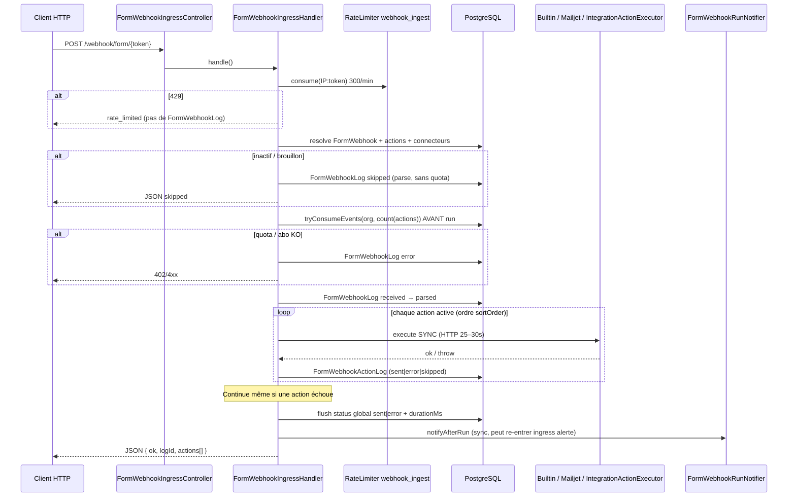

# Plan d’implémentation — Monitoring Webhooky

**Date :** 2026-07-24  
**Statut :** Phase 1 — Audit (aucune feature monitoring livrée)  
**Périmètre code :** `builder/` (SaaS) ; `site_vitrine/` hors scope métier monitoring (sauf page statut publique future)

---

## 1. Objectif de ce document

Ce fichier est le livrable obligatoire de la **Phase 1** avant tout développement UI/API monitoring.

Il :

1. décrit l’architecture **réelle** telle qu’audité dans le dépôt ;
2. cartographie le **cycle de vie actuel** d’un webhook ;
3. liste ce qui est **déjà mesurable** vs **manquant** ;
4. propose un **modèle cible** réaliste (sans infrastructure disproportionnée) ;
5. définit les **phases**, risques et complexités.

**Interdit jusqu’à validation de ce plan :** écrans fictifs, métriques inventées, tables génériques « fourre-tout JSON », appels fournisseurs facturables pour « health check ».

---

## 2. Architecture actuelle (vérifiée)

### 2.1 Stack

| Couche | Technologie constatée | Preuve |
|--------|----------------------|--------|
| Backend | PHP ≥ 8.2, **Symfony 7.4** | `builder/composer.json` |
| ORM / DB | Doctrine ORM 3.x, PostgreSQL 16 (compose) | `doctrine.yaml`, `compose.yaml` |
| Frontend | **React 18** + **Vite 5**, SPA (routing maison dans `App.jsx`) | `builder/package.json`, `assets/` |
| Auth | Session cookie `WEBHOOKYSESSID`, `json_login` `/api/login` | `security.yaml` |
| Files / workers | **Absents** — pas de `symfony/messenger` | `composer.json` |
| Cache / Redis | Filesystem Symfony ; Redis **commenté** | `cache.yaml` |
| Rate limit | Symfony RateLimiter (pool défaut) | `framework.yaml` → `webhook_ingest` |
| Billing | Stripe **WIP** (services + contrôleurs présents) | `Service/Billing/`, `stripe.yaml` |
| Observabilité | `ApplicationErrorLog` + journaux workflow ; **pas** de Monolog-bundle, **pas** de `/health` app, **pas** de Prometheus | Audit code |

### 2.2 Modèle multi-tenant

- **Tenant** = `Organization` (plan, quotas, préfixe ingress, Stripe IDs).
- **User** : rôles globaux `ROLE_USER` / `ROLE_MANAGER` / `ROLE_ADMIN` ; memberships org sans rôle org dédié.
- Isolation client : org courante de l’utilisateur ; admin = vue globale.
- Ingress public : authentification par **jeton** (`préfixe org` + UUID workflow), pas de session.

### 2.3 Routing UI actuel (à respecter)

Ce n’est **pas** une app multi-pages Symfony Twig. Les « routes » monitoring devront s’aligner sur le **routeur SPA** (`App.jsx`) + APIs JSON sous `/api/...`.

Exemples existants à étendre :

| Besoin | Pattern existant |
|--------|------------------|
| Admin | `/admin/...` + `ROLE_ADMIN` + lazy `AdminSupervision.jsx` |
| Client workflows / logs | `/workflows/...`, `/workflows/{id}/logs` |
| API admin | `/api/admin/...` |
| API client | `/api/form-webhooks/.../logs` |

**Mapping proposé** (indicatif, à finaliser en Phase 3) :

| Spec produit | Adaptation Webhooky |
|--------------|---------------------|
| `/admin/monitoring` | SPA `#/admin/monitoring` (ou path équivalent `App.jsx`) |
| `/app/monitoring` | SPA `#/monitoring` (scoped org) |
| APIs | `/api/admin/monitoring/*` et `/api/monitoring/*` |

### 2.4 Ce que Webhooky « monitoring » a déjà (sans le nommer ainsi)

| Capacité | Où |
|----------|-----|
| Journal d’exécution ingress | `form_webhook_log` + `FormWebhookLog` |
| Journal par action | `form_webhook_action_log` + alias sémantiques HTTP/recipient |
| UI client logs | `FormWebhooksPage` + `FormWebhookLogPanels` |
| Erreurs applicatives | `application_error_log` + AdminSupervision |
| Audit config | `resource_audit_log`, `user_account_audit_log` |
| Quotas événements | `organization_monthly_event_usage` + `SubscriptionEntitlementService` |
| Notif erreur/succès run | `FormWebhookRunNotifier` (webhook plateforme + SMTP) |
| Corps brut pretty + copie | UI logs (2026-07) |

**Ce n’est pas** une tour de contrôle : pas de score, agrégats, alertes structurées, coûts unitaires, retries, files, health.

---

## 3. Cycle de vie actuel d’un webhook

### 3.1 Diagramme (état réel)



### 3.2 Statuts persistés aujourd’hui

`FormWebhookLogStatus` (`builder/src/FormWebhook/FormWebhookLogStatus.php`) :

| Valeur | Usage actuel |
|--------|----------------|
| `received` | Log créé |
| `parsed` | Parse OK (intermédiaire) / action en cours |
| `sent` | Succès global ou succès d’une action |
| `error` | Échec parse, action, ou run partiel |
| `skipped` | Draft/inactive, ou action sautée (`if`) |

**Écart vs cahier des charges monitoring :** pas de `queued`, `retry_scheduled`, `dead_letter`, `partially_delivered`, `validating`, etc. — le pipeline est **100 % synchrone** dans une seule requête.

### 3.3 Points d’instrumentation naturels (déjà dans le chemin)

| Point | Fichier | Données déjà capturables |
|-------|---------|---------------------------|
| Entrée HTTP | `FormWebhookIngressController` | Méthode, token, timing wrapper |
| Rate limit | `FormWebhookIngressHandler` | Compteur 429 (aujourd’hui **non persisté**) |
| Résolution workflow | Handler + repositories | orgId, webhookId, lifecycle |
| Quota | `SubscriptionEntitlementService` | consumed / cap / mois |
| Parse | `PayloadParserChain` | durée, succès/échec, taille raw |
| Début/fin action | Handler loop | actionType, connectionId, durationMs |
| HTTP sortant | `IntegrationActionExecutor`, Mailjet | status, body tronqué, recipient |
| Builtin | `BuiltinWorkflowActionExecutor` | résultat tronqué |
| Fin run | Handler + RunNotifier | ok agrégé, notif OK/KO |
| Exception | `ApplicationErrorLogger` | message, contexte partiel |

### 3.4 Comportements critiques pour le design monitoring

1. **Pas de file** → « événements en attente / workers / DLQ » n’existent pas ; les KPI files seront `non_applicable` jusqu’à une éventuelle Phase Messenger (hors scope immédiat si on respecte « ne pas bloquer le traitement »).
2. **Quota pré-consommé** → un run en échec consomme quand même le quota ; le monitoring coûts/quotas doit l’afficher clairement.
3. **Continue-on-error** → un run peut être `error` avec des actions `sent` + `error` ; le funnel doit distinguer run vs action.
4. **Notifier sync** → latence et amplification possibles ; le monitoring ne doit **pas** ajouter d’autres appels sync lourds sur le chemin ingress.
5. **Aliases `mailjet*`** → les métriques « HTTP destination » doivent lire `httpStatus` / `providerResponseBody` (aliases), pas seulement Mailjet.

---

## 4. Données déjà disponibles

### 4.1 Exécution

- `FormWebhookLog` : `receivedAt`, IP, UA, contentType, `rawBody` (≤65k), `parsedInput`, status, `errorDetail`, `durationMs`, lien workflow → org.
- `FormWebhookActionLog` : sortOrder, variablesSent, recipient, status, httpStatus, provider body/messageId, errorDetail, durationMs, actionType via relation action.

### 4.2 Plateforme / admin

- `ApplicationErrorLog` : level, source, HTTP, user, org, context JSON.
- `ResourceAuditLog` / `UserAccountAuditLog` : changements config / comptes.

### 4.3 Quotas & commercial

- Plans Free / Starter / Pro (`SubscriptionPlan`, `SubscriptionPlanCatalog`).
- Compteur mensuel `OrganizationMonthlyEventUsage.eventCount`.
- Snapshot entitlements API (dashboard / facturation).
- Factures `OrganizationInvoice` (montants forfait / packs — **pas** coût unitaire SMS/email).

### 4.4 Non disponible (à ne pas inventer en UI)

| Besoin monitoring | État |
|-------------------|------|
| Correlation ID | Absent |
| Attempts / retry / DLQ | Absent |
| Queue backlog / heartbeat workers | N/A (pas de workers) |
| Coût SMS / email / HTTP par envoi | Absent |
| Agrégats minute/heure (tables) | Absent |
| Alertes structurées + incidents | Absent (seulement e-mail RunNotifier) |
| Health score | Absent |
| Signature webhook inbound (HMAC générique) | Non généralisé (auth = token URL) |
| Détection boucles / doublons | Absent |
| Page statut publique | Absente (volontairement côté vitrine) |

---

## 5. Modèle cible (pragmatique)

### 5.1 Principes non négociables

1. **Le chemin ingress reste prioritaire** : instrumentation = écriture légère / buffer ; jamais d’attente d’agrégats ou d’alertes.
2. **Panne monitoring ≠ panne produit** : try/catch autour des writers ; pas de throw remonté vers le client ingress.
3. **Réutiliser** `form_webhook_log` / `form_webhook_action_log` comme source de vérité des runs ; ajouter colonnes + tables d’agrégats / alertes.
4. **Pas de Messenger obligatoire en Phase 2–4** : on peut livrer une tour de contrôle sur données sync existantes + agrégations différées (cron). Messenger = Phase optionnelle « évolutivité ».
5. **Pas de fausse data prod** : fixtures / seed **dev/test** uniquement.
6. **Secrets masqués** : réutiliser patterns `ServiceConnectionSecretHelper` + filtre payload monitoring.

### 5.2 Architecture logique cible

```mermaid
flowchart TB
  Ingress[FormWebhookIngressHandler] -->|write sync léger| RunTables[form_webhook_log + action_log]
  Ingress -.->|fire-and-forget / buffer| MetricWriter[MonitoringMetricBuffer]
  MetricWriter --> RawOrCounters[compteurs / monitoring_metric_point]
  CronAgg[app:monitoring:aggregate] --> Agg[monitoring_metric_agg_minute/hour/day]
  CronAlert[app:monitoring:evaluate-alerts] --> Alerts[monitoring_alert]
  Alerts --> Incidents[monitoring_incident]
  CronCost[app:monitoring:calculate-costs] --> Costs[monitoring_cost_entry]
  APIAdmin[/api/admin/monitoring/*] --> Agg
  APIAdmin --> RunTables
  APIClient[/api/monitoring/*] --> RunTables
  SPAAdmin[SPA admin/monitoring] --> APIAdmin
  SPAClient[SPA monitoring] --> APIClient
```

### 5.3 Entités / tables proposées (créer seulement si nécessaires)

| Concept | Rôle | Priorité |
|---------|------|----------|
| Colonnes sur `form_webhook_log` | `correlation_id`, éventuellement `http_status_response`, `events_quota_consumed` | P0 |
| Colonnes sur `form_webhook_action_log` | `attempt` (défaut 1), `provider` dérivé du type | P0 |
| `monitoring_metric_agg_*` | Agrégats période × dimensions (org, type, provider) | P0 |
| `monitoring_alert` | Alertes dédupliquées | P1 |
| `monitoring_incident` + link alerts | Regroupement | P1 |
| `monitoring_setting` | Seuils configurables | P1 |
| `pricing_rule` + `monitoring_cost_entry` | Coûts datés | P2 |
| `monitoring_recommendation` | Recos déterministes (snapshot) | P2 |
| `deployment_event` | Timeline déploiements (manuel/CI) | P3 |
| Queue / worker tables | **Seulement si Messenger introduit** | P3+ |

Éviter une table unique `monitoring_events` JSON fourre-tout.

### 5.4 Catalogue métriques (phase 2 minimale — ancré sur données réelles)

| Clé | Source initiale | Unité |
|-----|-----------------|-------|
| `webhook.received.count` | Inserts `form_webhook_log` | count |
| `webhook.run.success.count` | status=`sent` | count |
| `webhook.run.error.count` | status=`error` | count |
| `webhook.run.skipped.count` | status=`skipped` | count |
| `webhook.processing.duration_ms` | `durationMs` | ms |
| `webhook.action.success.count` | action_log `sent` | count |
| `webhook.action.error.count` | action_log `error` | count |
| `webhook.action.duration_ms` | action_log `durationMs` | ms |
| `webhook.action.http_status` | `httpStatus` (bucket 2xx/4xx/5xx) | count |
| `webhook.rate_limited.count` | nouveau compteur (aujourd’hui perdu) | count |
| `quota.events.consumed` | `OrganizationMonthlyEventUsage` | count |
| `quota.events.cap` | entitlements | count |

Métriques files/workers/SMS coût : **marquées N/A** dans l’UI tant que non instrumentées (état `non_configuré` / `inconnu`), pas de graphiques vides inventés.

### 5.5 Score de santé (`WebhookyHealthScoreCalculator`)

Service backend explicable (pas de score inventé côté React).

Entrées initiales (pondération configurable via `monitoring_setting`) :

- taux succès runs 1h ;
- taux succès actions 1h ;
- p95 `durationMs` vs seuil ;
- alertes critiques ouvertes ;
- quota plateforme / orgs en `quota_atteint` (si détectable) ;
- (plus tard) latence fournisseurs, backlog files.

Sortie DTO : `{ score: 0–100, status, factors: [{ key, weight, value, contribution }] }`.

### 5.6 Mapping pipeline UI ↔ réalité sync

La chaîne visuelle demandée (Réception → … → Retry) doit être **honest** :

| Étape UI | Mapping réel Phase 3 |
|----------|----------------------|
| Réception | Count logs créés + 429 |
| Validation | Parse OK vs parse error |
| Identification source | Workflow/org résolus |
| Règles | N/A produit (pas de moteur de règles séparé) → **afficher « Actions du workflow »** |
| Transformation | Builtins `parse_json` / IA / GSC |
| Mise en file | **État : non applicable** (sync) |
| Transmission | Actions Mailjet / intégrations |
| Confirmation | HTTP 2xx / status sent |
| Retry | **État : non applicable** jusqu’à retry produit |

Ne pas simuler une file si elle n’existe pas.

---

## 6. Points d’instrumentation à ajouter (Phase 2)

| # | Changement | Impact ingress | Risque |
|---|------------|----------------|--------|
| 1 | Générer `correlation_id` (UUID) au début de `handle()`, le stocker sur le log, le renvoyer dans la réponse JSON | Faible | Faible |
| 2 | Compter / logger les `429` rate-limit (table agg ou log léger) | Très faible | Faible |
| 3 | Enregistrer `quotaUnitsConsumed` sur le log | Faible | Faible |
| 4 | Buffer métriques : incrément mémoire / table compteurs flush async **best-effort** (catch) | Faible | Moyen (perte métriques OK) |
| 5 | Masquage payload monitoring (liste de clés) pour API détail | Nul sur ingress | Faible |
| 6 | Lier `ApplicationErrorLog.context.formWebhookLogId` de façon systématique | Nul | Faible |

**Hors Phase 2 :** Messenger, DLQ, probes fournisseurs payants, page statut publique.

---

## 7. Plan par phases (complexité)

Échelle : **S** &lt; 2 j · **M** 2–5 j · **L** 1–2 sem · **XL** &gt; 2 sem

| Phase | Contenu | Complexité | Dépendances |
|-------|---------|------------|-------------|
| **1** | Audit + ce document | S | — |
| **2** | Instrumentation minimale (correlation, 429, masquage, buffer métriques, cron aggregate basique) | M | 1 |
| **3** | Tour de contrôle admin (overview DTO + SPA) : score, KPI, pipeline honest, domaines, anomalies | L | 2 |
| **4** | Liste/détail événements admin + enrichissement client logs (timeline, correlation, filtres) | M–L | 2 |
| **5** | Vues techniques : réception, « routage=actions », destinations HTTP, e-mails, SMS (agrégats sur action_log) ; files = page N/A explicite | L | 3–4 |
| **6** | Monitoring client (overview + events + consommation quotas) isolation org | M–L | 3–4 |
| **7** | Coûts : `pricing_rule` + calculator + UI (SMS/email/HTTP si tarifs saisis ; infra = saisie manuelle) | L | 2 |
| **8** | Alertes + incidents + notifications (e-mail / webhook plateforme existants) | L | 3, 5–6 |
| **9** | Optimisation : index, rétention, cache overview, tests charge, docs complètes | M | 3–8 |
| **10 (option)** | Messenger + retries + DLQ + workers monitoring | XL | Décision produit |

---

## 8. APIs cibles (synthèse — Phase 3+)

### Admin (`ROLE_ADMIN`)

- `GET /api/admin/monitoring/overview?period=`
- `GET /api/admin/monitoring/flows`
- `GET /api/admin/monitoring/events` + `/{id}`
- `GET /api/admin/monitoring/accounts` + `/{id}`
- `GET /api/admin/monitoring/costs`
- `GET /api/admin/monitoring/alerts` + POST acknowledge
- `GET /api/admin/monitoring/incidents`
- `GET /api/admin/monitoring/timeline`
- `GET|PUT /api/admin/monitoring/settings`

### Client (org scope)

- `GET /api/monitoring/overview`
- `GET /api/monitoring/events` + `/{id}`
- `GET /api/monitoring/consumption`
- `GET /api/monitoring/alerts`
- `POST /api/monitoring/events/{id}/retry` — **uniquement après** existence d’un retry produit (sinon 501 / feature flag)

Réutiliser patterns pagination/filtres de `ApiFormWebhookLogController`.

---

## 9. Sécurité & RGPD

- Endpoints admin : `ROLE_ADMIN` ; client : membership org + voter existant.
- Jamais exposer secrets connecteurs ; masquer clés JSON configurables.
- Numéros SMS partiels ; IP partiellement anonymisée en admin global si nécessaire.
- Rétention : s’aligner sur abonnements + purge commandée (Phase 9) ; payloads selon plan.
- Journaliser consultation payload complet et actions retry.

---

## 10. Risques

| Risque | Mitigation |
|--------|------------|
| Sur-promettre files/retries alors qu’ils n’existent pas | UI « non applicable » + Phase 10 optionnelle |
| Ralentir ingress avec écritures métriques | Best-effort + agrégation cron ; pas d’HTTP sync additionnel |
| Recalcul full-scan des logs à chaque dashboard | Tables d’agrégats + index `(received_at, org, status)` |
| Confusion Mailjet vs HTTP générique | Utiliser aliases sémantiques déjà livrés |
| Coûts faux | Pas d’affichage coût unitaire sans `pricing_rule` ; libellés « estimé » |
| Doublons d’alertes | Upsert par `(code, domain, account_id, fingerprint)` |
| Scope Stripe WIP | Ne pas bloquer monitoring sur billing incomplet |
| Volume TEXT logs | Truncation déjà en place ; rétention / pas de rechargement massif overview |

---

## 11. Plan de migration données

1. Migrations additive (colonnes nullable + nouvelles tables) — **pas de rewrite** des logs historiques.
2. Backfill optionnel : agrégats journaliers depuis `form_webhook_log` pour 30 j (commande one-shot, hors requête web).
3. Feature flags / settings : dashboards vides → EmptyState « Historique insuffisant » (critère acceptation §37).
4. Rollback : drop tables monitoring + ignore colonnes ; ingress reste fonctionnel.

---

## 12. Tests (prévus dès Phase 2–3)

Priorité backend :

- HealthScoreCalculator (facteurs connus) ;
- Isolation org sur API client ;
- Masquage secrets payload ;
- Agrégation idempotente ;
- Alertes : create vs update same fingerprint ;
- Ingress : correlation_id présent ; échec writer métriques n’altère pas HTTP 200 métier.

Frontend : overview loading / empty / partial error ; pas de graphique à 1 point trompeur.

Scénarios §44 du brief : mapper chacun à « données réelles » ou « N/A jusqu’à Phase X ».

---

## 13. Documentation à produire ensuite (Phases 2–9)

Ordre :

1. `docs/monitoring/README.md` (index)
2. `architecture.md`, `data-model.md`, `metrics-catalog.md`
3. `events-lifecycle.md` (évolution des statuts)
4. `alerts-and-incidents.md`, `cost-calculation.md`, `quotas.md`
5. `security-and-privacy.md`, `deployment.md`

Le présent fichier reste la **source de vérité planning**.

---

## 14. Décisions à valider avant Phase 2

1. **Messenger / retries produit** : reportés en Phase 10 optionnelle, ou priorisés maintenant ? (impact majeur UX monitoring.)
2. **Rétention payloads** par plan : valeurs exactes.
3. **Tarifs SMS/email** : saisie manuelle admin vs import fournisseur.
4. **Page statut publique** : hors scope immédiat (conforme vitrine actuelle).
5. **Nom des routes SPA** finales.

---

## 15. Prochaine action (après validation)

**Phase 2 — Instrumentation minimale uniquement :**

- `correlation_id` sur ingress + réponse ;
- compteur rate-limit ;
- buffer métriques best-effort ;
- commande `app:monitoring:aggregate` (skeleton) ;
- tests « monitoring down ≠ webhook down » ;
- **pas encore** de tour de contrôle visuelle complète.

---

## 16. Synthèse executive

Webhooky dispose déjà d’un **journal d’exécution synchrone** (logs workflow + erreurs app + quotas), mais **aucun monitoring plateforme** (score, agrégats, alertes, coûts unitaires, files).

Le plan retenu : **enrichir les logs existants**, ajouter des **agrégats et alertes hors chemin critique**, livrer une tour de contrôle **honnête** (sans simuler files/retries absents), puis étendre client / coûts / incidents. L’évolutivité (Messenger, DLQ, workers) est prévue mais **non bloquante** pour démarrer la valeur monitoring.
