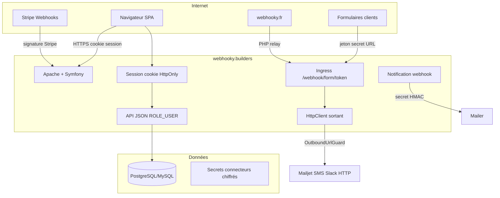

# SECURITY_ARCHITECTURE

## Vue d’ensemble

## Boundaries de confiance

| Zone | Confiance | Contrôles |
|------|-----------|-----------|
| SPA React | Non fiable | Auth réelle côté API ; UI gating seulement |
| Session cookie | Utilisateur authentifié | HttpOnly, SameSite=Lax, Secure auto, VerifiedUserChecker |
| Ingress form | Possession du jeton URL | Rate limit, quotas abo, validation payload |
| `/webhook/notification` | Secret partagé plateforme | HMAC/Bearer obligatoire en prod |
| Stripe webhook | Signature Stripe | `Webhook::constructEvent` |
| Appels sortants | Org manager config | `OutboundUrlGuard` anti-SSRF |
| Secrets connecteurs | Serveur | Chiffrement + masquage API |

## Authentification

- **Modèle :** session serveur Symfony + `json_login` (`/api/login`).
- **Pas de JWT applicatif** (choix volontaire) — pas de token dans `localStorage`.
- **Rôles :** `ROLE_USER`, `ROLE_MANAGER`, `ROLE_ADMIN` (+ checker e-mail vérifié).
- **Throttling login :** activé sur firewall `main`.

## Autorisation

- `access_control` path-based + `#[IsGranted]` sur controllers.
- Contrôles métier `canAccess` / `canManage*` par organisation.
- **Voter pilote** `OrganizationVoter` pour centraliser progressivement.

## Données sensibles

| Donnée | Protection |
|--------|------------|
| Mot de passe | Hasher `auto` (bcrypt/argon) |
| OAuth GSC | `SensitiveStringEncryptor` (sodium secretbox) |
| Secrets ServiceConnection | Chiffrement champs sensibles + masquage API |
| Payloads webhook | Journalisés pour diagnostic — responsabilité client / rétention |

## IA

- Provider actuel : Ollama (`baseUrl` org).
- `OutboundUrlGuard` empêche les cibles réseau privé.
- Prompt injection : risque métier documenté ; ne pas placer de secrets plateforme dans les prompts.

## Déploiement

- Apache front-controller (`public/`).
- Compose : Postgres (+ Mailpit en override **dev only**).
- Pas de conteneur app versionné — durcir l’hébergeur (TLS, WAF optionnel, backups).
